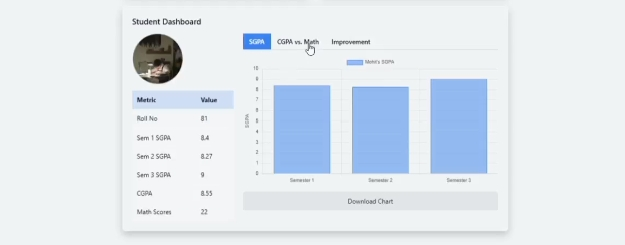

# cgpa-analysis-with-AI
I
 

  

This is a **CGPA analysis tool with personalized student dashboards**, built with HTML, CSS (Tailwind), JavaScript, Chart.js, and the  API. It provides an interactive, visually stunning platform to analyze student academic performance, featuring student photos, tabular metrics, tabbed charts, and AI-driven insights. Designed for educational analytics, it’s a standout addition to my portfolio, showcasing data visualization, frontend development, and AI integration.

### Tools and Modules 

  

## Features

- **Personalized Dashboards**: Displays student photo, a sleek table with metrics (Roll No, SGPA1, SGPA2, SGPA3, CGPA, Math Scores), and tabbed charts for each student.
- **Tabbed Charts**:
  - **SGPA Trends**: Bar chart showing SGPA across three semesters.
  - **CGPA vs. Math Scores**: Scatter plot comparing the student’s CGPA and math scores against peers.
  - **Improvement**: Line chart visualizing SGPA changes between semesters.
- **AI Insights**: Powered by the Gemini API, providing detailed performance summaries, semester-wise trends, and actionable improvement suggestions.
- **Interactive Features**:
  - Search bar to filter students by name or roll number.
  - Chart download as PNG.
  - Confetti animations for top performers (CGPA ≥ 8.0) and the highest CGPA student.
- **UI/UX**: Glassmorphism design with dark mode, slide-in animations, and responsive layout for mobile and desktop.
- **Accessibility**: ARIA labels, keyboard navigation, and screen reader support (e.g., `role="grid"`, `aria-live="polite"`).
- **Modular Code**: Organized into `index.html`, `styles.css`, and `script.js` for maintainability.

## Screenshots

  

student-dashboard/

├── index.html        # Main HTML structure

├── styles.css        # CSS with glassmorphism, animations, and table styling

├── script.js         # JavaScript logic for data, charts, API, and interactions

## Technologies Used

 -HTML5: Structure of the web application.
- CSS (Tailwind CSS): Styling with glassmorphism and responsive design.
- JavaScript: Core logic for data processing, chart rendering, and API integration.
- Chart.js: Data visualization for SGPA, CGPA vs. Math, and improvement charts.
- Canvas-Confetti: Animations for high performers.
- Gemini API: AI-driven performance insights and recommendations.

### Debugging

Console Errors: Check DevTools (F12) for null references or API errors. Share full error messages for support.

File Loading: Ensure styles.css and script.js load (Network tab, 200 OK).

Table/Charts: Verify table data (e.g., Mohit: Roll No 81, CGPA 8.55) and chart rendering.

API Issues: Test the Gemini API key in Postman for errors.

Accessibility: Test with a screen reader (e.g., NVDA) to ensure ARIA labels work.
